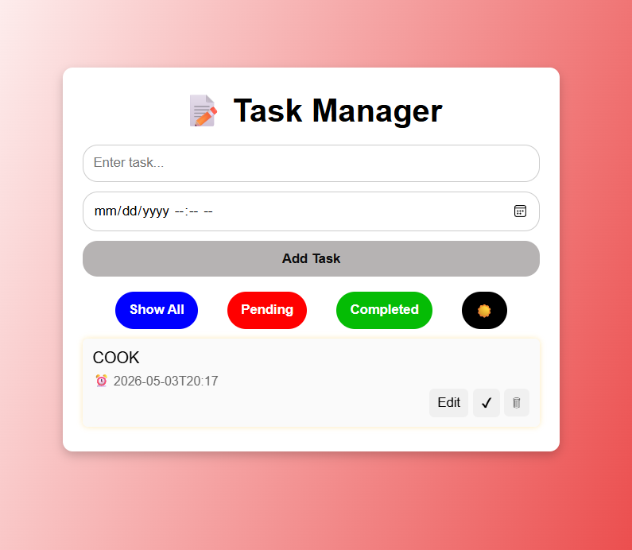
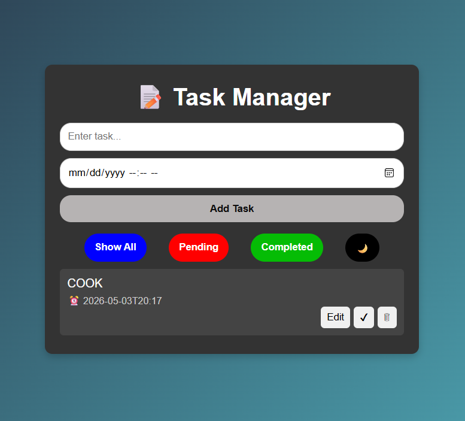

## 📝 Responsive Todo List App

A simple, responsive Todo List application built with HTML, CSS, and JavaScript.
This app allows users to add, edit, delete, and filter tasks, with support for datetime metadata, dark/light theme toggle, and localStorage persistence.

## 🚀 Features

Add Tasks: Create tasks with optional date/time.

Edit Tasks: Update task name and datetime.

Delete Tasks: Remove tasks with a smooth fade-out animation.

Toggle Status: Mark tasks as pending or completed.

Filter Tasks: Show all, pending, or completed tasks.

Theme Toggle: Switch between light ☀️ and dark 🌙 themes.

Persistent Storage: Tasks are saved in localStorage and remain after page reload.

Responsive Design: Works well on desktop and mobile devices.

Animations: Fade-in and fade-out effects for tasks, hover scaling for buttons.

## 📂 Project Structure

To-do-list/
│
├── CSS/
│   └── style.css          # Styles for layout, buttons, themes, animations
│
├── HTML/
│   └── index.html         # Main HTML structure
│
├── Images/
│   ├── lighttheme.png     # Screenshot of light theme
│   └── darktheme.png      # Screenshot of dark theme
│
├── JS/
│   └── script.js          # Core logic for task management
│
├── README_FILE/
│   └── README.md          # Documentation file

## ⚙️ Setup & Usage
1. Clone or download this repository.
2. Open `index.html` in your browser.
3. Add tasks using the input field and datetime picker.
4. Use filter buttons to view tasks by status.
5. Toggle between light/dark themes using the ☀️ / 🌙 button.


## 🖥️ Technologies Used

HTML5 – Structure of the app

CSS3 – Styling, gradients, animations, responsive design

JavaScript (ES6) – Task management logic, localStorage integration

## 📌 Code Highlights

### Task Persistence
```Javascript
let tasks = JSON.parse(localStorage.getItem("tasks")) || [];
function saveTasks() {
  localStorage.setItem("tasks", JSON.stringify(tasks));
}


Task Rendering

function renderTasks() {
  const list = document.getElementById("taskList");
  list.innerHTML = "";
  tasks
    .filter(task => currentFilter === "all" || task.status === currentFilter)
    .forEach((task, index) => {
      // Create task item with text, datetime, and action buttons
    });
}

Theme Toggle

function toggleTheme() {
  document.body.classList.toggle("dark");
  const btn = document.getElementById("themeBtn");
  btn.textContent = document.body.classList.contains("dark") ? "🌙" : "☀️";
}
```
## 🎨 Screenshots

### Light Theme


### Dark Theme


## 📖 Future Improvements

- [ ] Add categories/tags for tasks  
- [ ] Implement search functionality  
- [ ] Allow recurring tasks  
- [ ] Sync with cloud storage or backend database  

## 👨‍💻 Author

Developed by Piriyaram  
Location: Jaffna, Sri Lanka